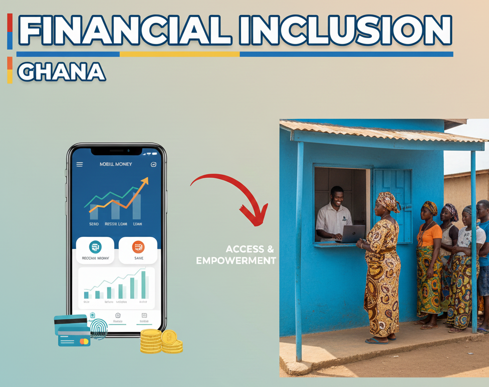

<h2 align="justified">
DATA ANALYST | RESEARCH & BUSINESS INTELLIGENCE
</h2>

  
  
  
  
  
  
  
  
  

💼 Data & Research Analyst | Stata • Analytics • Data Consulting

---

## 👨🏽‍💻 ABOUT ME 

Hi there 👋🏽 
I’m James Quarshie. I am a **data analyst and research professional** with hands-on experience across the full data lifecycle — from **survey design** and **digital data collection** to **statistical analysis** and **insight generation**. My work sits at the intersection of **research**, **business intelligence**, and **development practice**, where evidence is used to inform decisions, shape policy, and improve outcomes.

I have worked extensively with field survey platforms such as **Survey Solutions**, **SurveyCTO**, and **Kobo Collect**, and I am comfortable managing data from complex surveys through to clean, analysis-ready datasets. On the data managment, cleaning, and analytics side, I use **STATA**, **Python**, **SPSS**, **SQL**, and **Excel** to explore data, test hypotheses, and communicate findings clearly to both technical and non-technical audiences.

Beyond tools, I care about data quality, methodological rigor, and practical relevance. I enjoy translating raw data into insights that are actionable, defensible, and grounded in real-world contexts — particularly within research, monitoring & evaluation, and development-focused projects.

---

## 📊 DATA SKILLS 

| Category                               | Skills & Techniques                                                                                                                                   |
| -------------------------------------- | ----------------------------------------------------------------------------------------------------------------------------------------------------- |
| **Data Cleaning & Preparation**        | Data cleaning, missing data handling, variable recoding, data validation, transformation and harmonization (STATA, Python, Excel)                     |
| **Survey & Field Data Management**     | Survey design and deployment, CAPI workflows, enumerator monitoring, data quality checks, version control (SurveyCTO, Kobo Collect, Survey Solutions) |
| **Statistical & Econometric Analysis** | Descriptive statistics, regression analysis, panel data analysis, hypothesis testing, impact evaluation methods (STATA, SPSS, Python)                 |
| **Data Analysis & Visualization**      | Exploratory data analysis (EDA), dashboards, trend analysis, data storytelling, research visualizations (Excel, Power BI, Python)                     |
| **Database & Data Handling**           | Data merging and reshaping, relational datasets, SQL querying, structured data management  (STATA, SQL, Python)                                       |
| **Research & Evaluation (MEL)**        | Baseline, midline & endline studies, monitoring frameworks, indicator development, qualitative & quantitative analysis                                |
| **Reporting & Knowledge Products**     | Analytical reports, policy briefs, donor reports, executive summaries, data documentation                                                             |
| **Automation & Productivity Tools**    | Workflow automation, reproducible analysis, script-based reporting, research documentation (STATA do-files, Python scripts, Google Workspace)         |

---

## 📂 FEATURED PROJECTS

| Thumbnail | Project Title | Description | Repository |
|-----------|---------------|-------------|------------|
|  | **Data Management \| Ghana Socio-economic Panel Survey** | The GSPS is a major panel data implemented by the Global Poverty Research Lab at the Northwestern University (USA) and the Institute of Statistical Social and Economic Research (Ghana). For this project, I performed data management tasks, including data coding and full harmonization of 1000s of variables across the four major waves of the project. The project was implemented using `STATA`. | [GitHub](https://github.com/jkquarshie/gsps-data-management) |
|  | **The Impact of Governance Quality on Financial Inclusion** | An econometric analysis of the relationship between financial inclusion, governance quality, and economic growth in Ghana using World Bank data (2002–2021). The study applied VAR and VECM models in `STATA` and found that financial inclusion directly supports economic growth, while governance quality does not significantly moderate this effect. | [GitHub](https://github.com/yourusername/fin-gov) |
|  | **Ghana Private Sector Development Facility (PSDF) Evaluation Project** | The Ghana Private Sector Development Facility (GPSDF) was a multi-phase private sector development initiative aimed at strengthening the capacity competitiveness and growth of small and medium-sized enterprises (SMEs) in Ghana. The assignment involved the evaluation of Phases I and II of the GPSDF, using survey-based evidence and program data to assess performance, implementation effectiveness, and outcomes. | [GitHub](https://github.com/yourusername/gpsdf-evaluation) |

---

## 🛠️ TOOLS & TECH STACK

- **Tools:** STATA, Python, SQL, R (basic) 
- **Data & Analysis:** Pandas, NumPy, Jupyter, Excel  
- **Visualization:** Matplotlib, Seaborn  
- **Workflow:** Git, GitHub, Conda, VS Code  
- **Research:** Survey analysis, impact evaluation support, econometric analysis
- **Data Management** STATA, Excel, Google Sheets, SQL

---

## 🔭 CURRENTLY WORKING ON
- Building Python projects for data analysis & automation
- Organizing research workflows using reproducible code
- Developing a strong data & analytics portfolio on GitHub

---

## 📫 WORK WITH ME
- 💼 LinkedIn: https://linkedin.com/in/jkquarshie
- 📧 Email: jamescquarshie@gmail.com
- 📍 Ghana | Open to remote work.
- 🌍 Working across development, research & data-driven projects

---

⭐ *Data speaks. We listen, learn, lead.*

